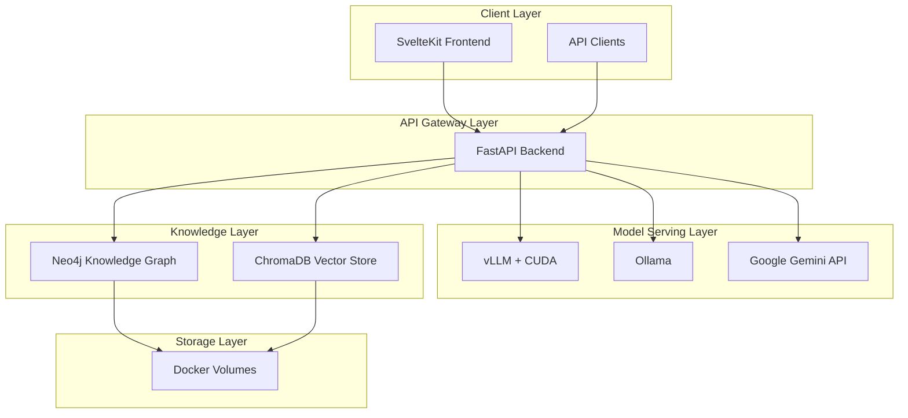

# Design Document

## Overview

Oracle is a containerized AI-powered troubleshooting chatbot system that leverages multiple knowledge retrieval approaches and flexible model serving. The system uses a microservices architecture deployed via Docker Compose, with each component running in isolated containers that communicate through defined APIs and Docker networks.

The core architecture follows a hybrid approach combining knowledge graphs (Neo4j) for structured relationship data and vector databases (ChromaDB) for semantic similarity search. This dual approach ensures comprehensive knowledge retrieval while maintaining system resilience through graceful degradation across multiple AI model providers.

## Architecture

### High-Level Architecture



### Container Architecture

The system consists of 4 main containers:

1. **oracle-backend**: FastAPI application with UV package management
2. **oracle-frontend**: SvelteKit 5 application served via Node.js
3. **oracle-vllm**: vLLM model serving with CUDA support
4. **oracle-neo4j**: Neo4j graph database for structured knowledge
5. **oracle-chromadb**: ChromaDB vector database for semantic search

### Network Design

All containers communicate through a custom Docker network (`oracle-network`) with the following internal routing:

- Frontend → Backend: `http://oracle-backend:8000`
- Backend → vLLM: `http://oracle-vllm:8001`
- Backend → Neo4j: `bolt://oracle-neo4j:7687`
- Backend → ChromaDB: `http://oracle-chromadb:8002`
- Backend → Ollama: Configurable external URL via environment variable

## Components and Interfaces

### FastAPI Backend Service

**Responsibilities:**
- API request routing and validation
- Model serving orchestration with fallback logic
- Knowledge retrieval coordination
- Document ingestion processing
- Response aggregation and formatting

**Key Endpoints:**
```python
POST /api/v1/chat
- Request: {"message": str, "context": Optional[dict]}
- Response: {"response": str, "confidence": float, "sources": list}

POST /api/v1/ingest
- Request: Multipart form with files
- Response: {"status": str, "processed_files": list, "errors": list}

GET /api/v1/health
- Response: {"status": str, "services": dict}
```

**Dependencies:**
- UV for package management
- FastAPI with Pydantic for validation
- httpx for async HTTP requests
- neo4j-driver for graph database connectivity
- chromadb-client for vector database operations

### Model Serving Layer

**Primary: vLLM Service**
- Container: `vllm/vllm-openai:latest` with CUDA runtime
- GPU Requirements: NVIDIA GPU with CUDA 11.8+
- Model Loading: Configurable via environment variables
- API Compatibility: OpenAI-compatible endpoints

**Fallback 1: Ollama Service**
- External service: User-provided Ollama instance
- Configuration: URL provided via environment variable (OLLAMA_BASE_URL)
- API Compatibility: OpenAI-compatible endpoints

**Fallback 2: Google Gemini API**
- External service integration
- API Key management via environment variables
- Rate limiting and error handling

### Knowledge Graph Service (Neo4j)

**Configuration:**
- Container: `neo4j:5.15-community`
- Authentication: Username/password via environment
- Plugins: APOC for advanced procedures
- Memory: Configurable heap and page cache

**Schema Design:**
```cypher
// Core entity types
(:Document {id, title, content, created_at})
(:Entity {name, type, description})
(:Concept {name, definition, category})

// Relationships
(:Document)-[:CONTAINS]->(:Entity)
(:Entity)-[:RELATES_TO]->(:Entity)
(:Concept)-[:PART_OF]->(:Concept)
```

### Vector Database Service (ChromaDB)

**Configuration:**
- Container: Custom ChromaDB container
- Persistence: SQLite backend with volume mounting
- Collections: Separate collections for different document types
- Embedding Model: Configurable sentence transformers

**Collection Schema:**
```python
{
    "documents": ["text content"],
    "metadatas": [{"source": "filename", "type": "document_type"}],
    "ids": ["unique_document_id"],
    "embeddings": [[float_vector]]
}
```

### Frontend Service (SvelteKit)

**Technology Stack:**
- SvelteKit 5 with TypeScript
- Tailwind CSS for styling
- WebSocket support for real-time chat
- File upload components for document ingestion

**Key Features:**
- Responsive chat interface
- Document upload with progress tracking
- Error handling and retry mechanisms
- Real-time status indicators for backend services

## Data Models

### Chat Request/Response Models

```python
class ChatRequest(BaseModel):
    message: str
    context: Optional[Dict[str, Any]] = None
    model_preference: Optional[str] = None

class ChatResponse(BaseModel):
    response: str
    confidence: float
    sources: List[Source]
    model_used: str
    processing_time: float

class Source(BaseModel):
    type: Literal["graph", "vector"]
    content: str
    relevance_score: float
    metadata: Dict[str, Any]
```

### Document Ingestion Models

```python
class IngestionRequest(BaseModel):
    files: List[UploadFile]
    processing_options: Optional[ProcessingOptions] = None

class IngestionResponse(BaseModel):
    status: str
    processed_files: List[ProcessedFile]
    errors: List[IngestionError]
    processing_time: float

class ProcessedFile(BaseModel):
    filename: str
    entities_extracted: int
    chunks_created: int
    graph_nodes_added: int
    vector_embeddings_created: int
```

## Error Handling

### Model Serving Fallback Chain

```python
async def get_model_response(prompt: str) -> ModelResponse:
    try:
        return await vllm_client.generate(prompt)
    except VLLMException:
        logger.warning("vLLM unavailable, falling back to Ollama")
        try:
            return await ollama_client.generate(prompt)
        except OllamaException:
            logger.warning("Ollama unavailable, falling back to Gemini")
            return await gemini_client.generate(prompt)
```

### Knowledge Retrieval Resilience

```python
async def retrieve_knowledge(query: str) -> KnowledgeContext:
    graph_results = []
    vector_results = []
    
    # Attempt graph retrieval
    try:
        graph_results = await neo4j_client.query(query)
    except Neo4jException as e:
        logger.error(f"Graph query failed: {e}")
    
    # Attempt vector retrieval
    try:
        vector_results = await chromadb_client.query(query)
    except ChromaDBException as e:
        logger.error(f"Vector query failed: {e}")
    
    return merge_knowledge_sources(graph_results, vector_results)
```

### HTTP Error Responses

- **500**: Internal server error with service status details
- **503**: Service unavailable when all model providers fail
- **422**: Validation errors for malformed requests
- **413**: Payload too large for document uploads
- **429**: Rate limiting when external APIs are throttled

## Testing Strategy

### Unit Testing
- **Backend**: pytest with async support for FastAPI endpoints
- **Model Integration**: Mock external services for reliable testing
- **Knowledge Retrieval**: Test graph and vector queries independently
- **Frontend**: Vitest for SvelteKit component testing

### Integration Testing
- **Docker Compose**: Test full stack deployment
- **API Endpoints**: End-to-end request/response validation
- **Fallback Logic**: Simulate service failures to test degradation
- **Data Persistence**: Verify data survives container restarts

### Performance Testing
- **Model Serving**: Benchmark response times across providers
- **Knowledge Retrieval**: Test query performance with large datasets
- **Concurrent Users**: Load testing with multiple simultaneous requests
- **Resource Usage**: Monitor container resource consumption

### Container Health Checks
```yaml
healthcheck:
  test: ["CMD", "curl", "-f", "http://localhost:8000/health"]
  interval: 30s
  timeout: 10s
  retries: 3
  start_period: 40s
```

Each service includes comprehensive health checks to ensure proper startup sequencing and runtime monitoring.