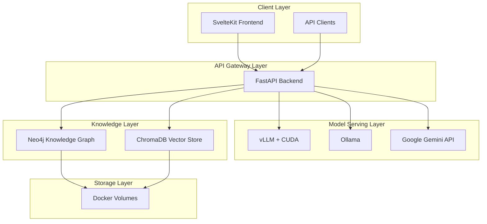

# Oracle Chatbot System

Oracle is a containerized AI-powered troubleshooting chatbot system that leverages multiple knowledge retrieval approaches and flexible model serving. The system uses a microservices architecture deployed via Docker Compose.

## Architecture Overview


- **Backend**: FastAPI with UV package management
- **Frontend**: SvelteKit 5 with TypeScript
- **Model Serving**: vLLM with CUDA support (primary), Ollama and Google Gemini (fallbacks)
- **Knowledge Graph**: Neo4j for structured relationship data
- **Vector Database**: ChromaDB for semantic similarity search

## Prerequisites

- Docker and Docker Compose
- NVIDIA Docker support (optional, for GPU acceleration)
- At least 8GB RAM (16GB recommended)
- 10GB free disk space

## Quick Start

1. **Clone and setup environment**:
   ```bash
   git clone <repository-url>
   cd oracle-chatbot-system
   cp .env.example .env
   ```

2. **Configure environment variables**:
   Edit `.env` file with your settings:
   ```bash
   # Required: Set secure passwords
   NEO4J_PASSWORD=your_secure_password_here
   
   # Optional: Change internal API key for vLLM (default: oracle-key)
   VLLM_API_KEY=oracle-key
   
   # Optional: Add API keys for fallback models
   GOOGLE_API_KEY=your_google_api_key_here
   OLLAMA_BASE_URL=http://your-ollama-server:11434
   ```

3. **Start the system**:
   ```bash
   # Using the startup script (recommended)
   ./scripts/start.sh
   
   # Or manually with docker-compose
   docker-compose up -d
   ```

4. **Access the application**:
   - Frontend: http://localhost:3000
   - Backend API: http://localhost:8000
   - API Documentation: http://localhost:8000/docs
   - Neo4j Browser: http://localhost:7474

## Development Setup

For development with hot reloading:

```bash
# Start in development mode
docker-compose -f docker-compose.yml -f docker-compose.dev.yml up -d

# View logs
docker-compose logs -f oracle-backend
docker-compose logs -f oracle-frontend
```

## Service Configuration

### Model Serving Priority

1. **vLLM** (Primary): Self-hosted GPU-accelerated inference
   - Uses internal API key for service authentication (configurable)
   - No external API costs
2. **Ollama** (Fallback): Self-hosted CPU/GPU inference via external service
   - Requires separate Ollama installation
3. **Google Gemini** (Fallback): Cloud API service
   - Requires Google API key and incurs usage costs

### Database Configuration

- **Neo4j**: Graph database for structured knowledge
  - Default credentials: neo4j/password (change in .env)
  - APOC plugins enabled for advanced procedures
  
- **ChromaDB**: Vector database for semantic search
  - Persistent storage with SQLite backend
  - Automatic embedding generation

## API Endpoints

### Chat API
```bash
# Send chat message
curl -X POST http://localhost:8000/api/v1/chat \
  -H "Content-Type: application/json" \
  -d '{"message": "How do I troubleshoot connection issues?"}'
```

### Document Ingestion
```bash
# Upload documents for knowledge base
curl -X POST http://localhost:8000/api/v1/ingest \
  -F "files=@document.pdf" \
  -F "files=@manual.txt"
```

### Health Check
```bash
# Check system health
curl http://localhost:8000/health
```

## Monitoring and Logs

```bash
# View all service logs
docker-compose logs -f

# View specific service logs
docker-compose logs -f oracle-backend
docker-compose logs -f oracle-frontend
docker-compose logs -f oracle-vllm

# Check service health
docker-compose ps
```

## Troubleshooting

### Common Issues

1. **GPU not detected**:
   - Install nvidia-docker2
   - Restart Docker daemon
   - Check `nvidia-smi` works in container

2. **Services not starting**:
   - Check Docker daemon is running
   - Verify port availability
   - Check logs: `docker-compose logs [service-name]`

3. **Database connection issues**:
   - Wait for health checks to pass
   - Check network connectivity between containers
   - Verify credentials in .env file

### Resource Requirements

- **Minimum**: 8GB RAM, 4 CPU cores
- **Recommended**: 16GB RAM, 8 CPU cores, NVIDIA GPU
- **Storage**: 10GB for containers and data

## Stopping the System

```bash
# Stop all services
docker-compose down

# Stop and remove volumes (WARNING: deletes all data)
docker-compose down -v

# Stop specific service
docker-compose stop oracle-backend
```

## Contributing

1. Fork the repository
2. Create a feature branch
3. Make changes with tests
4. Submit a pull request

## License

[Add your license information here]